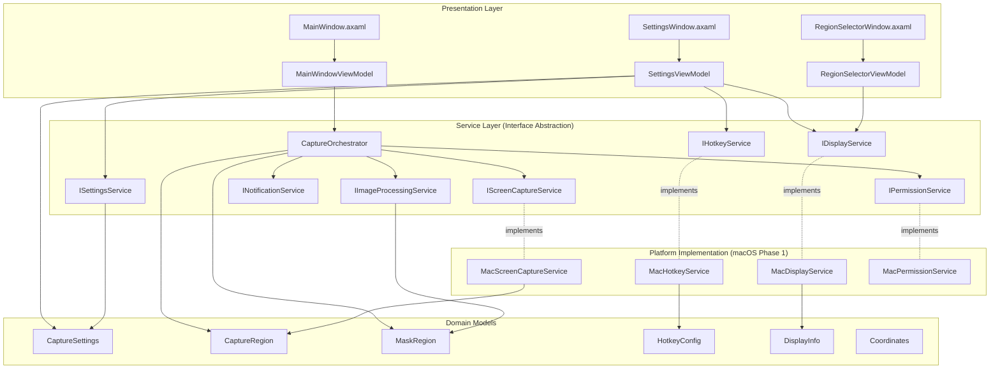
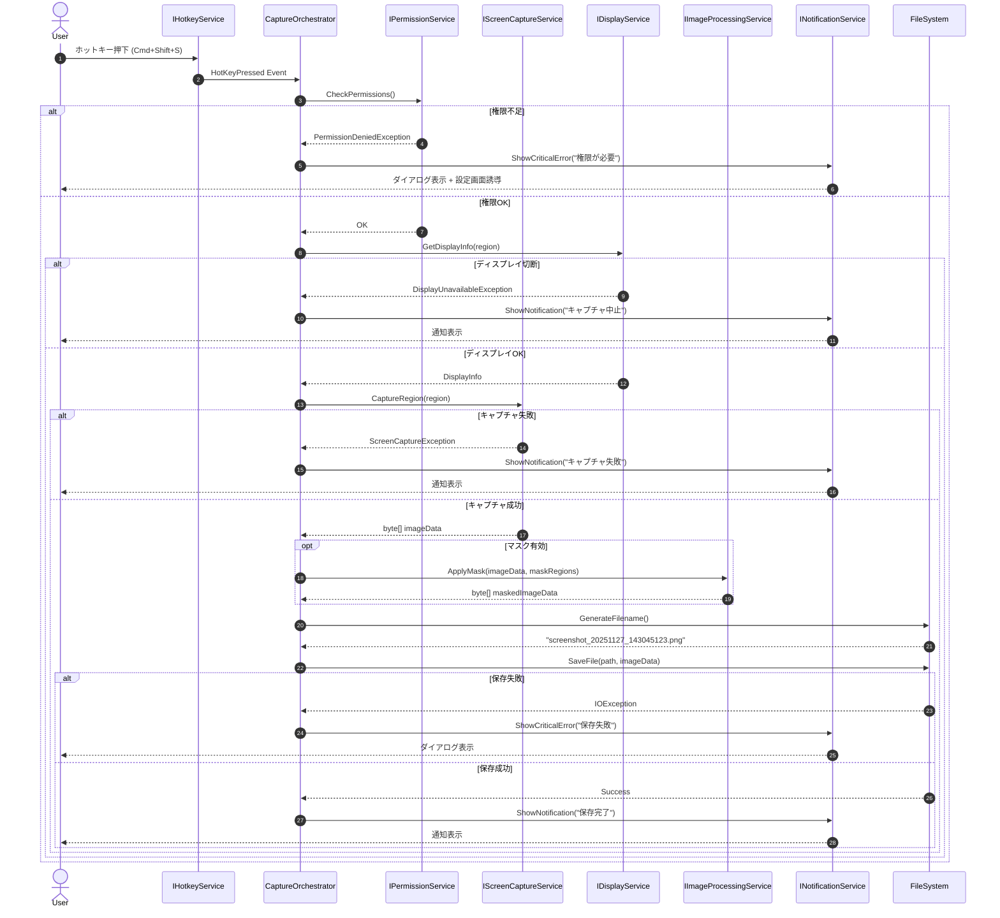
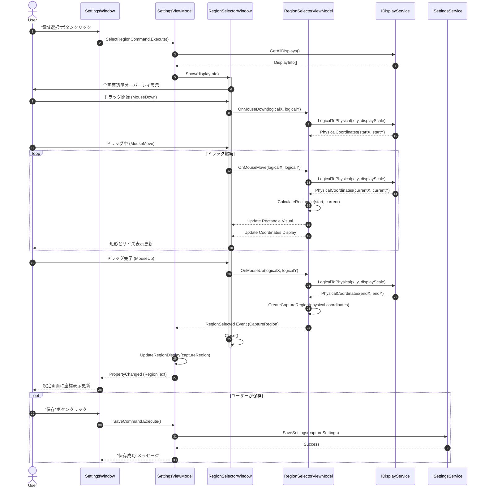
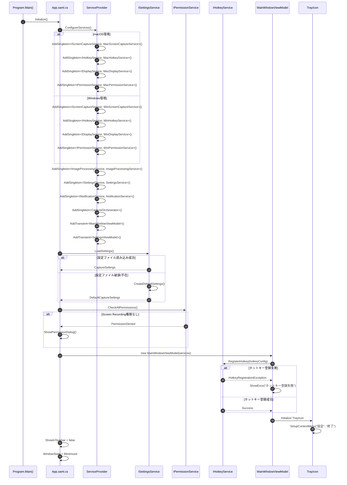
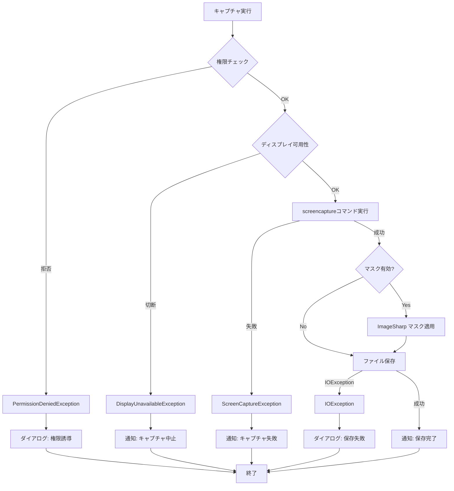

# Technical Design: screenshot-capture-system

---
**目的**: 実装者間での一貫性を保証し、解釈のずれを防ぐための十分な詳細を提供する。

**アプローチ**:
- 実装判断に直接影響する必須セクションを含める
- 実装エラー防止に重要でないオプションセクションは省略する
- 機能の複雑さに応じて詳細レベルを調整する
- 長文よりも図表を優先する
---

## Overview

**目的**: このフィーチャーは、**ゲームプレイヤー**に対して、Webブラウザで実行されるゲームのスクリーンショットをアンチチートシステムに検知されることなく安全に撮影する機能を提供します。OS標準APIによる非侵襲的キャプチャ、プライバシー保護のためのマスク機能、ホットキーによる高速ワークフローを実現します。

**ユーザー**: ゲームプレイヤーは、ゲームプレイ中にホットキー一つで指定領域のスクリーンショットを撮影し、個人情報を含む領域を自動マスクして保存するワークフローに利用します。

**影響**: 新規デスクトップアプリケーション（CanvasSnap）を構築します。既存システムへの変更はありません。

### Goals

- **安全なキャプチャ**: OS標準APIのみを使用し、ゲームプロセスへの干渉を完全に排除（Req 1）
- **高速ワークフロー**: ホットキー押下から0.5秒以内でキャプチャ完了（Req 11-1）
- **プライバシー保護**: 指定領域の自動黒塗りマスク機能（Req 4）
- **macOS MVP優先**: Phase 1でmacOS Monterey 12.0+対応を完成（Req 13-1）
- **Windows移植可能性**: サービス層の抽象化によりPhase 2でのWindows対応を実現（Req 13-4, 13-5）
- **低リソース常駐**: バックグラウンドアイドル時にCPU 3%未満、メモリ50MB未満（Req 11-2, 11-3）

### Non-Goals

- **Canvas要素の直接操作**: DOMアクセスやブラウザ拡張機能の利用は行わない（Req 1-5）
- **動画キャプチャ**: 静止画のみをサポート
- **クラウド同期**: Phase 1ではネットワーク通信を行わない（Req 12-4）
- **画像編集機能**: マスク以外の画像加工は提供しない
- **自動アップロード**: ローカルストレージへの保存のみ（Req 1-6）
- **macOS 12.0未満のサポート**: Monterey以降を対象（Req 13-1）

## Architecture

### Architecture Pattern & Boundary Map

**選定パターン**: MVVM (Model-View-ViewModel) + Service Layer

**理由**:
- Avalonia公式推奨、ReactiveUIとの高い親和性
- インターフェースベースのサービス層でmacOS/Windows実装の切り替えが容易
- 各ドメインの明確な境界により責務分離とテスト容易性を確保
- 詳細な評価は [research.md](research.md#architecture-pattern-evaluation) を参照

**アーキテクチャ構成図**:



**ドメイン境界**:

1. **Capture Domain**: スクリーンキャプチャ実行、画像処理、マスク適用
   - オーナーシップ: CaptureOrchestrator
   - 境界: キャプチャトリガーから画像ファイル保存まで
2. **Configuration Domain**: 設定永続化、検証、デフォルト値管理
   - オーナーシップ: ISettingsService
   - 境界: config.jsonの読み書き、設定バリデーション
3. **UI Domain**: ユーザーインタラクション、入力検証、フィードバック
   - オーナーシップ: ViewModels (ReactiveUI)
   - 境界: View層とService層の仲介
4. **Platform Domain**: OS固有機能の抽象化とプラットフォーム検出
   - オーナーシップ: 各IサービスのmacOS/Windows実装
   - 境界: インターフェース境界、実装はDIで注入

**Steering準拠**:
- `.kiro/steering/tech.md`: .NET 8, Avalonia 11, MVVM+ReactiveUI, ImageSharp使用
- `.kiro/steering/structure.md`: MVVMディレクトリ構成、サービスインターフェース、DI活用
- `.kiro/steering/product.md`: 非侵襲的設計、プライバシー保護、低リソース常駐

### Technology Stack

| Layer | Choice / Version | Role in Feature | Notes |
|-------|------------------|-----------------|-------|
| **UI Framework** | Avalonia 11.x | クロスプラットフォームUI、XAML定義、システムトレイ統合 | Req 13-3準拠、macOS/Windows対応 |
| **UI Pattern** | ReactiveUI 19.x | MVVM実装、リアクティブプロパティ、コマンドバインディング | Avaloniaベストプラクティス |
| **Runtime** | .NET 8.0 | アプリケーションランタイム、P/Invoke、プロセス管理 | Req 13-2準拠 |
| **Image Processing** | SixLabors.ImageSharp 3.x | PNG保存、マスク適用、アルファ合成 | クロスプラットフォーム、高速処理 |
| **DI Container** | Microsoft.Extensions.DependencyInjection | サービス登録、ライフタイム管理、プラットフォーム切り替え | .NET標準 |
| **Serialization** | System.Text.Json | 設定ファイルJSON読み書き | .NET標準、高速 |
| **Testing** | xUnit, Moq, ReactiveUI.Testing | 単体テスト、モック、ViewModelテスト | .NETエコシステム標準 |
| **Performance** | BenchmarkDotNet | パフォーマンス計測、0.5秒目標検証 | Req 11-1検証用 |

**macOS Platform APIs** (Phase 1):
- `screencapture` コマンド: 画面キャプチャ実行（Req 1-7）
- CGEvent API (Quartz Event Services): グローバルホットキー登録
- NSScreen API: ディスプレイ情報取得、HiDPI scaling factor
- NSUserNotification / UNUserNotificationCenter: OS標準通知
- TCC (Transparency, Consent, and Control): Screen Recording権限管理

**Windows Platform APIs** (Phase 2想定):
- BitBlt / Windows.Graphics.Capture API: 画面キャプチャ（Req 1-8）
- RegisterHotKey API: グローバルホットキー
- Windows.Graphics.Display: ディスプレイ情報、DPI取得
- Windows.UI.Notifications: トースト通知

## System Flows

### キャプチャ実行フロー

ホットキー押下からファイル保存までのエンドツーエンドフロー。エラー分岐を含む。



**フロー決定事項**:
- 権限チェックを最初に実行（ユーザー体験向上）
- ディスプレイ可用性チェック（Req 2-9）で接続切断を検出
- マスク適用は画像データ取得後にオプショナル処理
- エラー分類（クリティカル/軽微）に応じて通知方法を切り替え

### 領域選択フロー

キャプチャ領域およびマスク領域の選択UIインタラクション。座標変換を含む。



**座標変換の重要性**:
- UI表示は論理座標（Logical Pixels）を使用（Req 3-3）
- 内部保存は物理座標（Physical Pixels）に変換（Req 3-4）
- IDisplayServiceがHiDPI scaling factorを考慮した変換を提供
- マスク領域は相対座標で保存（キャプチャ領域左上が原点）

### アプリケーション起動フロー

起動時の初期化、DI設定、権限チェック、設定読み込みシーケンス。



**起動時決定事項**:
- DIコンテナでプラットフォーム検出と実装切り替え（Req 13-4）
- 設定ファイル破損時はデフォルト設定で継続（Req 7-5, 7-6）
- 権限不足時も起動を継続し、ダイアログで誘導（Req 12-2）
- ホットキー登録失敗は非クリティカルエラーとして処理

## Requirements Traceability

| Requirement | Summary | Components | Interfaces | Flows |
|-------------|---------|------------|------------|-------|
| 1.1-1.8 | 安全なスクリーンキャプチャ | CaptureOrchestrator, IScreenCaptureService実装 | IScreenCaptureService.CaptureRegion | キャプチャ実行フロー |
| 2.1-2.9 | キャプチャ領域管理 | RegionSelectorViewModel, IDisplayService | IDisplayService.GetAllDisplays, LogicalToPhysical | 領域選択フロー |
| 3.1-3.4 | HiDPI対応 | IDisplayService, PhysicalCoordinates, LogicalCoordinates | IDisplayService.GetScaleFactor | 領域選択フロー |
| 4.1-4.5 | プライバシーマスク | IImageProcessingService, MaskRegion | IImageProcessingService.ApplyMask | キャプチャ実行フロー |
| 5.1-5.6 | ホットキー操作 | IHotkeyService, HotkeyConfig | IHotkeyService.RegisterHotkey | アプリ起動フロー, キャプチャ実行フロー |
| 6.1-6.8 | ファイル保存 | CaptureOrchestrator, FileSystem (System.IO) | File.WriteAllBytesAsync, CaptureOrchestrator.GenerateFilePath | キャプチャ実行フロー |
| 7.1-7.7 | 設定永続化 | ISettingsService, CaptureSettings | ISettingsService.LoadSettings, SaveSettings | アプリ起動フロー |
| 8.1-8.10 | 設定画面UI | SettingsViewModel, SettingsWindow | ReactiveCommand, INotifyPropertyChanged | 領域選択フロー |
| 9.1-9.5 | システムトレイ | MainWindowViewModel, TrayIcon (Avalonia) | TrayIcon.ContextMenu | アプリ起動フロー |
| 10.1-10.4 | 通知システム | INotificationService | INotificationService.ShowNotification, ShowCriticalError | キャプチャ実行フロー |
| 11.1-11.3 | パフォーマンス | 全コンポーネント（最適化） | - | BenchmarkDotNetで検証 |
| 12.1-12.4 | 権限管理 | IPermissionService | IPermissionService.CheckPermissions | アプリ起動フロー, キャプチャ実行フロー |
| 13.1-13.5 | プラットフォーム互換性 | 全Iサービスインターフェース、DI設定 | プラットフォーム別実装 | アプリ起動フロー |

## Components and Interfaces

### Quick Reference

| Component | Domain/Layer | Intent | Req Coverage | Key Dependencies | Contracts |
|-----------|--------------|--------|--------------|------------------|-----------|
| **CaptureOrchestrator** | Capture | キャプチャフロー全体の調整 | 1, 6, 10, 11 | IScreenCaptureService (P0), IImageProcessingService (P1), INotificationService (P0) | Service |
| **IScreenCaptureService** | Platform | OS依存キャプチャAPI抽象化 | 1, 13 | Platform APIs (P0) | Service |
| **IImageProcessingService** | Capture | マスク適用、PNGバイナリ生成 | 4 | ImageSharp (P0) | Service |
| **IHotkeyService** | Platform | グローバルホットキー登録 | 5, 13 | Platform APIs (P0) | Service |
| **IDisplayService** | Platform | ディスプレイ情報、座標変換 | 2, 3, 13 | Platform APIs (P0) | Service |
| **ISettingsService** | Configuration | 設定永続化、JSON読み書き | 7 | System.Text.Json (P0) | Service |
| **INotificationService** | Platform | OS標準通知、ダイアログ | 10 | Platform APIs (P0) | Service |
| **IPermissionService** | Platform | 権限チェック、誘導UI | 12, 13 | Platform APIs (P0) | Service |
| **MainWindowViewModel** | UI | トレイアイコン制御 | 9 | CaptureOrchestrator (P0), IHotkeyService (P0) | State |
| **SettingsViewModel** | UI | 設定画面ロジック | 8, 7 | ISettingsService (P0), IDisplayService (P0), IHotkeyService (P0) | State |
| **RegionSelectorViewModel** | UI | 領域選択オーバーレイ | 2, 3 | IDisplayService (P0) | State |
| **CaptureSettings** | Domain Model | 設定集約ルート | 7 | - | Data Model |
| **CaptureRegion** | Domain Model | 物理ピクセル座標 | 2, 3 | - | Data Model |
| **MaskRegion** | Domain Model | 相対座標マスク領域 | 4 | - | Data Model |
| **HotkeyConfig** | Domain Model | ホットキー定義 | 5 | - | Data Model |
| **DisplayInfo** | Domain Model | ディスプレイメタデータ | 2, 3 | - | Data Model |
| **Coordinates** | Domain Model | 座標変換用型 | 3 | - | Data Model |

### Capture Domain

#### CaptureOrchestrator

| Field | Detail |
|-------|--------|
| Intent | キャプチャフロー全体を調整し、権限確認→キャプチャ→マスク→保存→通知を実行 |
| Requirements | 1.1, 6.1-6.8, 10.1-10.4, 11.1 |
| Owner / Reviewers | - |

**Responsibilities & Constraints**
- キャプチャトリガー受信からファイル保存までのエンドツーエンド処理
- エラーハンドリングと適切な通知方法の選択（クリティカル/軽微）
- リソースクリーンアップ（中間画像データのDispose）
- トランザクション境界: 1回のキャプチャ操作

**Dependencies**
- Inbound: MainWindowViewModel — ホットキーイベント転送 (P0)
- Outbound: IScreenCaptureService — 画面キャプチャ実行 (P0)
- Outbound: IImageProcessingService — マスク適用（オプション） (P1)
- Outbound: IPermissionService — 権限事前チェック (P0)
- Outbound: IDisplayService — ディスプレイ可用性確認 (P0)
- Outbound: INotificationService — 成功/失敗通知 (P0)
- External: FileSystem (System.IO) — **ファイル保存の責務を持つ** - `File.WriteAllBytesAsync()`でPNG保存 (P0)

**Contracts**: Service [x]

##### Service Interface
```csharp
public interface ICaptureOrchestrator
{
    /// <summary>
    /// キャプチャフローを実行（権限確認、キャプチャ、マスク、保存、通知）
    /// </summary>
    /// <param name="settings">キャプチャ設定（領域、マスク、保存先）</param>
    /// <returns>成功時はファイルパス、失敗時はエラー情報</returns>
    Task<Result<string, CaptureError>> ExecuteCaptureAsync(CaptureSettings settings);
}

public class CaptureOrchestrator : ICaptureOrchestrator
{
    public async Task<Result<string, CaptureError>> ExecuteCaptureAsync(CaptureSettings settings)
    {
        byte[]? imageData = null;

        try
        {
            // 1. 権限チェック
            if (!await _permissionService.CheckPermissionsAsync())
                return Result<string, CaptureError>.Error(CaptureError.PermissionDenied);

            // 2. ディスプレイ可用性確認
            var displayInfo = await _displayService.GetDisplayInfoAsync(settings.Region);
            if (displayInfo is null)
                return Result<string, CaptureError>.Error(CaptureError.DisplayUnavailable);

            // 3. キャプチャ実行
            imageData = await _screenCaptureService.CaptureRegionAsync(settings.Region);

            // 4. マスク適用（有効時）
            if (settings.IsMaskEnabled && settings.MaskRegions.Any())
            {
                imageData = await _imageProcessingService.ApplyMaskAsync(imageData, settings.MaskRegions);
            }

            // 5. ファイル保存
            var filePath = GenerateFilePath(settings.SaveDirectory);
            await File.WriteAllBytesAsync(filePath, imageData);

            // 6. 通知
            await _notificationService.ShowNotificationAsync("スクリーンショットを保存しました");

            return Result<string, CaptureError>.Success(filePath);
        }
        catch (PermissionDeniedException ex)
        {
            _logger.LogError(ex, "Permission denied");
            await _notificationService.ShowCriticalErrorAsync("権限エラー", "必要な権限が付与されていません");
            return Result<string, CaptureError>.Error(CaptureError.PermissionDenied);
        }
        catch (ScreenCaptureException ex)
        {
            _logger.LogWarning(ex, "Screen capture failed");
            await _notificationService.ShowNotificationAsync("キャプチャに失敗しました");
            return Result<string, CaptureError>.Error(CaptureError.CaptureFailed);
        }
        catch (IOException ex)
        {
            _logger.LogError(ex, "File save failed");
            await _notificationService.ShowCriticalErrorAsync("保存エラー", "ファイルの保存に失敗しました");
            return Result<string, CaptureError>.Error(CaptureError.SaveFailed);
        }
        catch (Exception ex)
        {
            _logger.LogError(ex, "Unexpected error during capture");
            await _notificationService.ShowCriticalErrorAsync("エラー", "予期しないエラーが発生しました");
            return Result<string, CaptureError>.Error(CaptureError.Unknown);
        }
        finally
        {
            // リソースクリーンアップ（必要に応じて）
            imageData = null;
        }
    }
}

public enum CaptureError
{
    PermissionDenied,
    DisplayUnavailable,
    CaptureFailed,
    SaveFailed,
    Unknown
}
```

- **Preconditions**: CaptureSettingsが有効（領域サイズ > 0、保存先ディレクトリ存在）
- **Postconditions**: PNGファイルが保存先に作成、または`Result<T, CaptureError>`でエラー返却
- **Invariants**: 処理中の画像データは最終的にDispose、ファイル名重複時は連番付与、例外は外部に漏らさない

**Implementation Notes**
- **Integration**: MainWindowViewModelがホットキーイベントを受信し、ExecuteCaptureAsyncを呼び出し
- **Validation**: 設定検証はISettingsServiceで事前実施、Orchestratorは検証済み設定を受け取る
- **Risks**: screencaptureコマンドの0.5秒目標未達時はPhase 2でScreenCaptureKit移行

**Phase 2移行判断基準**:
- 0.5秒以内: 目標達成、Phase 1で完了
- 0.5-0.7秒: 許容範囲、ユーザーフィードバック次第で検討
- 0.7秒超過: 必須移行、ScreenCaptureKit実装を優先

#### IImageProcessingService

| Field | Detail |
|-------|--------|
| Intent | マスク適用（黒塗り）とPNGバイナリ生成を提供 |
| Requirements | 4.1-4.5 |

**Responsibilities & Constraints**
- ImageSharpを使用した画像操作（マスク適用、PNGエンコード）
- マスク領域の黒塗り（#000000）
- PNG形式でのバイナリ生成（`byte[]`返却）
- **ファイルI/Oは責務外** - ファイル保存はCaptureOrchestratorが担当
- メモリ効率的な処理（ストリーム優先）

**Dependencies**
- Inbound: CaptureOrchestrator — マスク適用依頼 (P0)
- External: SixLabors.ImageSharp — 画像処理 (P0)

**Contracts**: Service [x]

##### Service Interface
```csharp
public interface IImageProcessingService
{
    /// <summary>
    /// 画像にマスク領域を適用（黒塗り）
    /// </summary>
    /// <param name="imageData">元画像データ（PNG）</param>
    /// <param name="maskRegions">マスク領域（相対座標）</param>
    /// <returns>マスク適用後のPNG画像データ（byte[]）</returns>
    Task<byte[]> ApplyMaskAsync(byte[] imageData, IEnumerable<MaskRegion> maskRegions);
}

// 実装例
public class ImageProcessingService : IImageProcessingService
{
    public async Task<byte[]> ApplyMaskAsync(byte[] imageData, IEnumerable<MaskRegion> maskRegions)
    {
        using var image = await Image.LoadAsync<Rgba32>(new MemoryStream(imageData));

        image.Mutate(ctx =>
        {
            foreach (var mask in maskRegions)
            {
                var rect = new Rectangle(mask.X, mask.Y, mask.Width, mask.Height);
                ctx.Fill(Color.Black, rect);
            }
        });

        using var output = new MemoryStream();
        await image.SaveAsPngAsync(output);
        return output.ToArray();
    }
}
```

- **Preconditions**: imageDataが有効なPNG形式、maskRegions座標が画像サイズ内
- **Postconditions**: マスク領域が#000000で塗りつぶされたPNG画像
- **Invariants**: 元画像データは変更しない（新しいbyte[]を返す）

**Implementation Notes**
- **Performance**: ImageSharpのRectangleはミューターブル設計（パフォーマンス最適化済み）
- **Memory**: ストリーム処理で中間バッファを最小化、50MB制約遵守（Req 11-2）

### Platform Domain

#### IScreenCaptureService

| Field | Detail |
|-------|--------|
| Intent | OS固有の画面キャプチャAPIを抽象化 |
| Requirements | 1.1-1.8, 13.1-13.5 |

**Responsibilities & Constraints**
- プラットフォーム別実装（macOS: screencapture, Windows: BitBlt/WGC）
- 物理ピクセル座標でのキャプチャ実行
- 権限不足時の適切な例外スロー
- 0.5秒以内のキャプチャ完了（Req 11-1）

**Dependencies**
- Inbound: CaptureOrchestrator — キャプチャ実行依頼 (P0)
- External (macOS): `screencapture` コマンド (P0)
- External (Windows): BitBlt / Windows.Graphics.Capture API (P0)

**Contracts**: Service [x]

##### Service Interface
```csharp
public interface IScreenCaptureService
{
    /// <summary>
    /// 指定領域のスクリーンキャプチャを実行
    /// </summary>
    /// <param name="region">物理ピクセル座標の矩形領域</param>
    /// <returns>PNG形式の画像データ</returns>
    /// <exception cref="ScreenCaptureException">キャプチャ失敗時</exception>
    /// <exception cref="PermissionDeniedException">Screen Recording権限不足時</exception>
    Task<byte[]> CaptureRegionAsync(CaptureRegion region);
}

// macOS実装
public class MacScreenCaptureService : IScreenCaptureService
{
    public async Task<byte[]> CaptureRegionAsync(CaptureRegion region)
    {
        var tempFile = Path.GetTempFileName() + ".png";
        var args = $"-R{region.X},{region.Y},{region.Width},{region.Height} -x -t png {tempFile}";

        var process = Process.Start("screencapture", args);
        await process.WaitForExitAsync();

        if (process.ExitCode != 0)
            throw new ScreenCaptureException($"screencapture failed with exit code {process.ExitCode}");

        var imageData = await File.ReadAllBytesAsync(tempFile);
        File.Delete(tempFile);

        return imageData;
    }
}
```

- **Preconditions**: Screen Recording権限が付与済み、region座標がディスプレイ境界内
- **Postconditions**: PNG形式の画像データ返却、または例外スロー
- **Invariants**: 一時ファイルは確実に削除（finally句で保証）

**Implementation Notes**
- **macOS注意点**: screencapture終了コードの公式仕様なし、実装時に検証
- **Performance**: Phase 1実装後にBenchmarkDotNetで0.5秒達成確認、未達時はScreenCaptureKit検討

#### IHotkeyService

| Field | Detail |
|-------|--------|
| Intent | グローバルホットキー登録とイベント発火 |
| Requirements | 5.1-5.6, 13.4 |

**Responsibilities & Constraints**
- プラットフォーム別実装（macOS: CGEvent API, Windows: RegisterHotKey）
- ホットキー競合検出と登録拒否
- IMEがオンでもホットキーに反応（Req 5-5）
- アプリ終了時のクリーンアップ（CFRunLoopStop, UnregisterHotKey）

**Dependencies**
- Inbound: MainWindowViewModel — ホットキー登録依頼、イベント購読 (P0)
- External (macOS): CGEvent API（Quartz Event Services） (P0)
- External (Windows): RegisterHotKey API (P0)

**Contracts**: Service [x], Event [x]

##### Service Interface
```csharp
public interface IHotkeyService
{
    /// <summary>
    /// グローバルホットキーを登録
    /// </summary>
    /// <param name="config">ホットキー設定（修飾キー + キーコード）</param>
    /// <exception cref="HotkeyConflictException">OS予約ショートカットと競合</exception>
    /// <exception cref="HotkeyRegistrationException">登録失敗</exception>
    Task RegisterHotkeyAsync(HotkeyConfig config);

    /// <summary>
    /// ホットキー登録を解除
    /// </summary>
    Task UnregisterHotkeyAsync();

    /// <summary>
    /// ホットキー押下イベント
    /// </summary>
    event EventHandler HotkeyPressed;
}

// macOS実装（CGEvent API）
public class MacHotkeyService : IHotkeyService
{
    private IntPtr _eventTap;
    private IntPtr _runLoopSource;
    private CFRunLoop _threadRunLoop;
    private Thread _runLoopThread;

    public async Task RegisterHotkeyAsync(HotkeyConfig config)
    {
        _eventTap = CGEventTapCreate(
            kCGSessionEventTap,
            kCGHeadInsertEventTap,
            kCGEventTapOptionDefault,
            CGEventMaskBit(kCGEventKeyDown),
            EventCallback,
            IntPtr.Zero);

        if (_eventTap == IntPtr.Zero)
            throw new HotkeyRegistrationException("Failed to create event tap");

        _runLoopSource = CFMachPortCreateRunLoopSource(IntPtr.Zero, _eventTap, 0);

        _runLoopThread = new Thread(RunLoopThreadProc) { IsBackground = true };
        _runLoopThread.Start();
    }

    private void RunLoopThreadProc()
    {
        _threadRunLoop = CFRunLoopGetCurrent();
        CFRunLoopAddSource(_threadRunLoop, _runLoopSource, kCFRunLoopCommonModes);
        CGEventTapEnable(_eventTap, true);
        CFRunLoopRun(); // ブロッキング
    }

    private IntPtr EventCallback(IntPtr proxy, uint type, IntPtr eventRef, IntPtr userInfo)
    {
        if (type == kCGEventKeyDown)
        {
            var keyCode = (int)CGEventGetIntegerValueField(eventRef, kCGKeyboardEventKeycode);
            var flags = CGEventGetFlags(eventRef);

            if (MatchesConfig(keyCode, flags))
            {
                HotkeyPressed?.Invoke(this, EventArgs.Empty);
                return IntPtr.Zero; // イベント消費
            }
        }
        return eventRef; // イベント伝播
    }
}
```

- **Preconditions**: macOSアクセシビリティ権限が付与済み
- **Postconditions**: ホットキー押下時にHotkeyPressedイベント発火
- **Invariants**: 登録は1つのみ、再登録時は既存を解除してから登録

##### Event Contract
- **Published events**: `HotkeyPressed` — ホットキー押下時に発火
- **Subscribed events**: なし
- **Ordering / delivery guarantees**: イベントは押下順に同期発火
- **⚠️ スレッドコンテキスト重要**: このイベントは**バックグラウンドスレッド（CFRunLoopスレッド）で発火**します。購読者がUI更新を行う場合は、必ず`Dispatcher.UIThread.InvokeAsync()`または`Dispatcher.UIThread.Post()`を使用してUIスレッドにマーシャリングしてください。UIスレッド外からのUI操作は例外を引き起こします。

**Implementation Notes**
- **macOS CGEvent API**: 完全な実装コードは `macos-global-hotkey-final-report.md` 参照
- **リソース管理**: UnregisterHotkeyAsyncでCFRunLoopStop、CGEventTapEnable(false)、リソース解放を確実に実施
- **権限**: アクセシビリティ権限が必須（Screen Recording権限に追加）

#### IDisplayService

| Field | Detail |
|-------|--------|
| Intent | ディスプレイ情報取得、座標変換、HiDPI対応 |
| Requirements | 2.6-2.9, 3.1-3.4, 13.4 |

**Responsibilities & Constraints**
- マルチディスプレイ環境の情報取得
- 論理座標⇔物理座標変換（HiDPI scaling factor考慮）
- ディスプレイ構成変更検出
- ディスプレイ切断時の可用性チェック（Req 2-9）

**Dependencies**
- Inbound: RegionSelectorViewModel, SettingsViewModel, CaptureOrchestrator (P0)
- External (macOS): NSScreen API (P0)
- External (Windows): Windows.Graphics.Display API (P0)

**Contracts**: Service [x]

##### Service Interface
```csharp
public interface IDisplayService
{
    /// <summary>
    /// 全ディスプレイ情報を取得
    /// </summary>
    Task<IEnumerable<DisplayInfo>> GetAllDisplaysAsync();

    /// <summary>
    /// 指定領域が含まれるディスプレイ情報を取得
    /// </summary>
    /// <returns>ディスプレイが利用不可の場合はnull</returns>
    Task<DisplayInfo?> GetDisplayInfoAsync(CaptureRegion region);

    /// <summary>
    /// 論理座標を物理座標に変換
    /// </summary>
    PhysicalCoordinates LogicalToPhysical(LogicalCoordinates logical, double scaleFactor);

    /// <summary>
    /// 物理座標を論理座標に変換
    /// </summary>
    LogicalCoordinates PhysicalToLogical(PhysicalCoordinates physical, double scaleFactor);

    /// <summary>
    /// ディスプレイ構成変更イベント
    /// </summary>
    event EventHandler DisplayConfigurationChanged;
}

public record DisplayInfo(
    int Id,
    string Name,
    int X,
    int Y,
    int Width,
    int Height,
    double ScaleFactor,
    bool IsPrimary
);

public record PhysicalCoordinates(int X, int Y);
public record LogicalCoordinates(int X, int Y);
```

- **Preconditions**: なし（ディスプレイ情報取得は常に可能）
- **Postconditions**: 現在のディスプレイ構成を正確に反映
- **Invariants**: ScaleFactorは常に正の値（macOS Retinaは2.0、非Retinaは1.0）

**Implementation Notes**
- **macOS座標系**: プライマリディスプレイ左上が(0,0)、左側セカンダリは負のX座標
- **ディスプレイ構成変更**: macOS NSWorkspace.Notifications.DidChangeScreenParametersNotification を監視、イベント発火

#### IPermissionService

| Field | Detail |
|-------|--------|
| Intent | OS権限チェック、権限誘導UI |
| Requirements | 12.1-12.3 |

**Responsibilities & Constraints**
- Screen Recording権限チェック（macOS）
- アクセシビリティ権限チェック（macOS、CGEvent API用）
- 権限不足時のシステム設定画面誘導
- Info.plist記載の用途説明と整合性確保

**Dependencies**
- Inbound: CaptureOrchestrator, App起動時 (P0)
- External (macOS): TCC (Transparency, Consent, and Control) (P0)

**Contracts**: Service [x]

##### Service Interface
```csharp
public interface IPermissionService
{
    /// <summary>
    /// 必要な全権限をチェック
    /// </summary>
    /// <returns>全権限が付与されている場合true</returns>
    Task<bool> CheckPermissionsAsync();

    /// <summary>
    /// Screen Recording権限をチェック
    /// </summary>
    Task<bool> CheckScreenRecordingPermissionAsync();

    /// <summary>
    /// アクセシビリティ権限をチェック（macOS CGEvent API用）
    /// </summary>
    Task<bool> CheckAccessibilityPermissionAsync();

    /// <summary>
    /// システム設定の権限画面を開く
    /// </summary>
    Task OpenPermissionSettingsAsync();
}

// macOS実装
public class MacPermissionService : IPermissionService
{
    public async Task<bool> CheckScreenRecordingPermissionAsync()
    {
        // macOS 10.15+ TCC
        var hasPermission = CGPreflightScreenCaptureAccess();
        if (!hasPermission)
        {
            CGRequestScreenCaptureAccess();
        }
        return hasPermission;
    }

    public async Task<bool> CheckAccessibilityPermissionAsync()
    {
        var options = new NSDictionary();
        return AXIsProcessTrusted(options);
    }

    public async Task OpenPermissionSettingsAsync()
    {
        Process.Start("open", "x-apple.systempreferences:com.apple.preference.security?Privacy_ScreenCapture");
    }
}
```

- **Preconditions**: macOS 12.0以降（Req 13-1）
- **Postconditions**: 権限状態を正確に返却、または設定画面を開く
- **Invariants**: 権限チェックは非侵襲的（許可ダイアログを自動表示しない）

**Implementation Notes**
- **macOS権限**: Screen Recording（必須）+ アクセシビリティ（CGEvent API用）
- **Info.plist**: `NSScreenCaptureUsageDescription` に「ゲーム画面のスクリーンショット撮影に使用」を記載

#### INotificationService

| Field | Detail |
|-------|--------|
| Intent | OS標準通知、ダイアログ表示 |
| Requirements | 10.1-10.4 |

**Responsibilities & Constraints**
- 軽微なエラー: OS標準通知
- クリティカルエラー: ダイアログ（ブロッキング）
- 成功通知: OS標準通知
- エラー分類とメッセージ作成

**Dependencies**
- Inbound: CaptureOrchestrator, ViewModels (P0)
- External (macOS): NSUserNotification / UNUserNotificationCenter (P0)
- External (Windows): Windows.UI.Notifications (P0)

**Contracts**: Service [x]

##### Service Interface
```csharp
public interface INotificationService
{
    /// <summary>
    /// OS標準通知を表示（軽微なエラー、成功メッセージ）
    /// </summary>
    Task ShowNotificationAsync(string message, NotificationType type = NotificationType.Info);

    /// <summary>
    /// クリティカルエラーダイアログを表示（ブロッキング）
    /// </summary>
    Task ShowCriticalErrorAsync(string title, string message, string[] actionButtons = null);
}

public enum NotificationType
{
    Info,
    Success,
    Warning,
    Error
}
```

- **Preconditions**: なし
- **Postconditions**: 通知またはダイアログが表示される
- **Invariants**: クリティカルエラーはユーザーアクションまでブロック

**Implementation Notes**
- **エラー分類**: 権限拒否、保存先アクセス不可 → クリティカル、一時的なキャプチャ失敗 → 軽微

#### ISettingsService

| Field | Detail |
|-------|--------|
| Intent | 設定ファイルのJSON読み書き、デフォルト設定管理 |
| Requirements | 7.1-7.7 |

**Responsibilities & Constraints**
- config.json の読み込み、パース、検証
- 設定の保存、シリアライズ
- 破損ファイルのバックアップとデフォルト復元
- プラットフォーム別の設定パス管理

**Dependencies**
- Inbound: App起動時, SettingsViewModel (P0)
- External: System.Text.Json (P0), FileSystem (P0)

**Contracts**: Service [x]

##### Service Interface
```csharp
public interface ISettingsService
{
    /// <summary>
    /// 設定ファイルを読み込み
    /// </summary>
    /// <returns>設定オブジェクト、読み込み失敗時はデフォルト設定</returns>
    Task<CaptureSettings> LoadSettingsAsync();

    /// <summary>
    /// 設定をファイルに保存
    /// </summary>
    Task SaveSettingsAsync(CaptureSettings settings);

    /// <summary>
    /// デフォルト設定を取得
    /// </summary>
    CaptureSettings GetDefaultSettings();

    /// <summary>
    /// 設定ファイルパスを取得
    /// </summary>
    string GetConfigFilePath();
}

// 実装例
public class SettingsService : ISettingsService
{
    public async Task<CaptureSettings> LoadSettingsAsync()
    {
        var configPath = GetConfigFilePath();

        if (!File.Exists(configPath))
            return GetDefaultSettings();

        try
        {
            var json = await File.ReadAllTextAsync(configPath);
            return JsonSerializer.Deserialize<CaptureSettings>(json);
        }
        catch (JsonException)
        {
            // 破損ファイルをバックアップ
            File.Move(configPath, configPath + ".backup", overwrite: true);
            return GetDefaultSettings();
        }
    }

    public string GetConfigFilePath()
    {
        if (OperatingSystem.IsMacOS())
            return Path.Combine(Environment.GetFolderPath(Environment.SpecialFolder.ApplicationSupport), "CanvasSnap", "config.json");
        else if (OperatingSystem.IsWindows())
            return Path.Combine(Environment.GetFolderPath(Environment.SpecialFolder.ApplicationData), "CanvasSnap", "config.json");

        throw new PlatformNotSupportedException();
    }
}
```

- **Preconditions**: なし（ファイル不在・破損時はデフォルト設定で継続）
- **Postconditions**: 有効な設定オブジェクト返却、保存時はJSON整形して書き込み
- **Invariants**: 設定ファイル破損時は必ず.backupで保存してからデフォルト復元

**Implementation Notes**
- **macOS**: `~/Library/Application Support/CanvasSnap/config.json`
- **Windows**: `%AppData%\CanvasSnap\config.json`
- **破損検出**: JsonExceptionキャッチ時にバックアップ作成、ユーザーに通知（Req 7-7）

### UI Domain

#### MainWindowViewModel

| Field | Detail |
|-------|--------|
| Intent | トレイアイコン制御、ホットキーイベント受信、設定ウィンドウ起動 |
| Requirements | 9.1-9.5 |

**Responsibilities & Constraints**
- TrayIconの初期化とコンテキストメニュー構築
- ホットキーイベント購読とCaptureOrchestratorへの転送
- 設定ウィンドウの表示/非表示管理
- アプリケーション終了処理

**Dependencies**
- Inbound: App.xaml.cs — ViewModel生成、DI注入 (P0)
- Outbound: CaptureOrchestrator — キャプチャ実行 (P0)
- Outbound: IHotkeyService — イベント購読 (P0)
- Outbound: ISettingsService — 起動時設定読み込み (P0)

**Contracts**: State [x]

##### State Management
- **State model**: ReactiveUIのReactiveObjectベース、INotifyPropertyChangedで通知
- **Persistence & consistency**: 設定はISettingsServiceで永続化
- **Concurrency strategy**: UIスレッド同期（Avalonia Dispatcher）

```csharp
public class MainWindowViewModel : ReactiveObject
{
    private readonly CaptureOrchestrator _orchestrator;
    private readonly IHotkeyService _hotkeyService;
    private readonly ISettingsService _settingsService;

    public MainWindowViewModel(
        CaptureOrchestrator orchestrator,
        IHotkeyService hotkeyService,
        ISettingsService settingsService)
    {
        _orchestrator = orchestrator;
        _hotkeyService = hotkeyService;
        _settingsService = settingsService;

        ShowSettingsCommand = ReactiveCommand.Create(ShowSettings);
        ExitCommand = ReactiveCommand.Create(Exit);

        _hotkeyService.HotkeyPressed += OnHotkeyPressed;
    }

    public ICommand ShowSettingsCommand { get; }
    public ICommand ExitCommand { get; }

    private async void OnHotkeyPressed(object sender, EventArgs e)
    {
        // ⚠️ 重要: HotkeyPressedイベントはバックグラウンドスレッド（CFRunLoopスレッド）で発火
        // UI操作や通知表示を行う前に、必ずUIスレッドにマーシャリングする
        await Dispatcher.UIThread.InvokeAsync(async () =>
        {
            var settings = await _settingsService.LoadSettingsAsync();
            var result = await _orchestrator.ExecuteCaptureAsync(settings);

            // resultの判定（UI更新が必要な場合はここで実行）
            if (result.IsError)
            {
                // エラー通知はOrchestratorが既に実施済み（設計方針による）
            }
        });
    }

    private void ShowSettings()
    {
        var settingsWindow = new SettingsWindow
        {
            DataContext = new SettingsViewModel(_settingsService, /* ... */)
        };
        settingsWindow.Show();
    }
}
```

**Implementation Notes**
- **TrayIcon**: App.axamlで`<TrayIcon.Icons>`定義、コンテキストメニューをViewModelのコマンドにバインド
- **WindowState**: `ShowInTaskbar=false`, `WindowState=Minimized` でバックグラウンド常駐

#### SettingsViewModel

| Field | Detail |
|-------|--------|
| Intent | 設定画面のロジック、領域選択トリガー、設定保存 |
| Requirements | 8.1-8.10 |

**Responsibilities & Constraints**
- 設定値の表示（ホットキー、キャプチャ領域、マスク、保存先）
- 領域選択ウィンドウの起動
- テストキャプチャ実行
- 設定バリデーションと保存

**Dependencies**
- Inbound: SettingsWindow.axaml (P0)
- Outbound: ISettingsService — 設定読み書き (P0)
- Outbound: IDisplayService — ディスプレイ情報取得 (P0)
- Outbound: IHotkeyService — ホットキー登録 (P0)
- Outbound: CaptureOrchestrator — テストキャプチャ (P0)

**Contracts**: State [x]

##### State Management
```csharp
public class SettingsViewModel : ReactiveObject
{
    private CaptureSettings _settings;

    [Reactive]
    public string HotkeyText { get; set; }

    [Reactive]
    public string RegionText { get; set; }

    [Reactive]
    public string MaskText { get; set; }

    [Reactive]
    public bool IsMaskEnabled { get; set; }

    [Reactive]
    public string SaveDirectory { get; set; }

    public ICommand SelectRegionCommand { get; }
    public ICommand SelectMaskCommand { get; }
    public ICommand TestCaptureCommand { get; }
    public ICommand SaveCommand { get; }
    public ICommand BrowseDirectoryCommand { get; }

    public SettingsViewModel(ISettingsService settingsService, /* ... */)
    {
        SelectRegionCommand = ReactiveCommand.CreateFromTask(SelectRegionAsync);
        SaveCommand = ReactiveCommand.CreateFromTask(SaveSettingsAsync);

        // 起動時に設定読み込み
        LoadSettingsAsync();
    }

    private async Task SelectRegionAsync()
    {
        var displays = await _displayService.GetAllDisplaysAsync();
        var selectorWindow = new RegionSelectorWindow
        {
            DataContext = new RegionSelectorViewModel(_displayService, displays)
        };

        selectorWindow.RegionSelected += (s, region) =>
        {
            _settings.Region = region;
            RegionText = $"({region.X}, {region.Y}, {region.Width}, {region.Height})";
        };

        selectorWindow.ShowDialog();
    }

    private async Task SaveSettingsAsync()
    {
        await _settingsService.SaveSettingsAsync(_settings);
        await _hotkeyService.RegisterHotkeyAsync(_settings.HotkeyConfig);
        // 成功メッセージ表示（Req 8-10）
    }
}
```

**Implementation Notes**
- **ReactiveUI**: `[Reactive]` 属性でプロパティ変更通知を自動生成
- **バリデーション**: 保存先書き込み権限チェック（Req 8-9）、ホットキー競合チェック

#### RegionSelectorViewModel

| Field | Detail |
|-------|--------|
| Intent | 全画面透明オーバーレイでの矩形選択、座標変換 |
| Requirements | 2.1-2.9, 3.1-3.4 |

**Responsibilities & Constraints**
- マウスドラッグによる矩形選択
- 論理座標→物理座標変換（リアルタイム）
- 座標とサイズのリアルタイム表示
- ESCキーでキャンセル

**Dependencies**
- Inbound: RegionSelectorWindow.axaml (P0)
- Outbound: IDisplayService — 座標変換 (P0)

**Contracts**: State [x]

##### State Management
```csharp
public class RegionSelectorViewModel : ReactiveObject
{
    private readonly IDisplayService _displayService;
    private readonly DisplayInfo _currentDisplay;
    private LogicalCoordinates _startPoint;

    [Reactive]
    public int RectangleX { get; set; }

    [Reactive]
    public int RectangleY { get; set; }

    [Reactive]
    public int RectangleWidth { get; set; }

    [Reactive]
    public int RectangleHeight { get; set; }

    [Reactive]
    public string CoordinatesText { get; set; }

    public event EventHandler<CaptureRegion> RegionSelected;

    public void OnMouseDown(int logicalX, int logicalY)
    {
        _startPoint = new LogicalCoordinates(logicalX, logicalY);
    }

    public void OnMouseMove(int logicalX, int logicalY)
    {
        var current = new LogicalCoordinates(logicalX, logicalY);

        RectangleX = Math.Min(_startPoint.X, current.X);
        RectangleY = Math.Min(_startPoint.Y, current.Y);
        RectangleWidth = Math.Abs(current.X - _startPoint.X);
        RectangleHeight = Math.Abs(current.Y - _startPoint.Y);

        CoordinatesText = $"({RectangleX}, {RectangleY}, {RectangleWidth}, {RectangleHeight})";
    }

    public void OnMouseUp(int logicalX, int logicalY)
    {
        var startPhysical = _displayService.LogicalToPhysical(_startPoint, _currentDisplay.ScaleFactor);
        var endPhysical = _displayService.LogicalToPhysical(new LogicalCoordinates(logicalX, logicalY), _currentDisplay.ScaleFactor);

        var region = new CaptureRegion(
            Math.Min(startPhysical.X, endPhysical.X),
            Math.Min(startPhysical.Y, endPhysical.Y),
            Math.Abs(endPhysical.X - startPhysical.X),
            Math.Abs(endPhysical.Y - startPhysical.Y)
        );

        RegionSelected?.Invoke(this, region);
    }
}
```

**Implementation Notes**
- **座標系**: UI表示は論理座標（Req 3-3）、イベント発火時に物理座標変換（Req 3-4）
- **マルチディスプレイ**: Phase 1ではプライマリディスプレイのみ、Phase 2で全ディスプレイ対応

## Data Models

### Domain Model

**集約ルート**: CaptureSettings

**エンティティ**:
- CaptureSettings（集約ルート）
  - CaptureRegion（値オブジェクト）
  - MaskRegion[] (値オブジェクトのコレクション)
  - HotkeyConfig（値オブジェクト）
  - SaveDirectory（文字列）
  - IsMaskEnabled（ブール）

**ビジネスルール**:
- キャプチャ領域は0より大きいサイズを持つ
- マスク領域はキャプチャ領域内に収まる（相対座標で管理）
- ホットキーは修飾キー + 通常キーの組み合わせ
- 保存先ディレクトリは書き込み権限があるパス

**不変条件**:
- CaptureRegion.Width > 0 && CaptureRegion.Height > 0
- MaskRegion.X + MaskRegion.Width <= CaptureRegion.Width
- HotkeyConfig.Modifiers は少なくとも1つの修飾キーを含む

### Logical Data Model

**エンティティ関係**:
```
CaptureSettings 1 --- 1 CaptureRegion
CaptureSettings 1 --- 0..* MaskRegion
CaptureSettings 1 --- 1 HotkeyConfig
```

**属性とデータ型**:

**CaptureSettings**
- Region: CaptureRegion（必須）
- MaskRegions: MaskRegion[]（オプション）
- HotkeyConfig: HotkeyConfig（必須）
- SaveDirectory: string（必須、デフォルト: ピクチャフォルダ）
- IsMaskEnabled: bool（必須、デフォルト: false）

**CaptureRegion** (物理ピクセル座標)
- X: int（プライマリディスプレイ左上からの絶対X座標）
- Y: int（プライマリディスプレイ左上からの絶対Y座標）
- Width: int（幅、ピクセル）
- Height: int（高さ、ピクセル）

**MaskRegion** (相対座標)
- X: int（キャプチャ領域左上からの相対X座標）
- Y: int（キャプチャ領域左上からの相対Y座標）
- Width: int（幅、ピクセル）
- Height: int（高さ、ピクセル）

**HotkeyConfig**
- Modifiers: HotkeyModifiers（フラグ列挙型: Cmd/Ctrl, Shift, Alt）
- Key: int（キーコード）

**DisplayInfo**
- Id: int
- Name: string
- X: int（絶対座標）
- Y: int（絶対座標）
- Width: int（ピクセル）
- Height: int（ピクセル）
- ScaleFactor: double（HiDPI倍率、Retina: 2.0）
- IsPrimary: bool

**PhysicalCoordinates / LogicalCoordinates**
- X: int
- Y: int

**整合性ルール**:
- トランザクション境界: 設定保存は単一のJSON書き込みトランザクション
- カスケードルール: CaptureSettingsの削除時にMaskRegions[]も削除（参照型の自動管理）

### Physical Data Model

**JSON Schema (config.json)**:

```json
{
  "$schema": "http://json-schema.org/draft-07/schema#",
  "type": "object",
  "required": ["region", "hotkeyConfig", "saveDirectory", "isMaskEnabled"],
  "properties": {
    "region": {
      "type": "object",
      "required": ["x", "y", "width", "height"],
      "properties": {
        "x": { "type": "integer" },
        "y": { "type": "integer" },
        "width": { "type": "integer", "minimum": 1 },
        "height": { "type": "integer", "minimum": 1 }
      }
    },
    "maskRegions": {
      "type": "array",
      "items": {
        "type": "object",
        "required": ["x", "y", "width", "height"],
        "properties": {
          "x": { "type": "integer", "minimum": 0 },
          "y": { "type": "integer", "minimum": 0 },
          "width": { "type": "integer", "minimum": 1 },
          "height": { "type": "integer", "minimum": 1 }
        }
      }
    },
    "hotkeyConfig": {
      "type": "object",
      "required": ["modifiers", "keyCode"],
      "properties": {
        "modifiers": { "type": "integer" },
        "keyCode": { "type": "integer" }
      }
    },
    "saveDirectory": { "type": "string" },
    "isMaskEnabled": { "type": "boolean" }
  }
}
```

**ファイルパス**:
- macOS: `~/Library/Application Support/CanvasSnap/config.json`
- Windows: `%AppData%\CanvasSnap\config.json`

**C# モデル定義**:

```csharp
public record CaptureSettings
{
    public required CaptureRegion Region { get; init; }
    public MaskRegion[] MaskRegions { get; init; } = Array.Empty<MaskRegion>();
    public required HotkeyConfig HotkeyConfig { get; init; }
    public required string SaveDirectory { get; init; }
    public bool IsMaskEnabled { get; init; }
}

public record CaptureRegion(int X, int Y, int Width, int Height);

public record MaskRegion(int X, int Y, int Width, int Height);

public record HotkeyConfig(HotkeyModifiers Modifiers, int KeyCode);

[Flags]
public enum HotkeyModifiers
{
    None = 0,
    Control = 1 << 0,  // Ctrl (Windows), Cmd (macOS)
    Shift = 1 << 1,
    Alt = 1 << 2
}
```

**インデックス**: なし（単一設定ファイル）

**バックアップ戦略**: 破損検出時に`.backup`拡張子で保存（Req 7-6）

## Error Handling

### Error Strategy

例外ベースのエラーハンドリングとResult型の併用。

**レイヤー別責務**:
1. **Services**: 型付き例外をスロー（ScreenCaptureException, PermissionDeniedException等）
2. **Orchestrator**: **すべての例外をcatchしてログ記録、リソースクリーンアップ、`Result<T, CaptureError>`に変換** - 例外を外部に漏らさない
3. **ViewModels**: Orchestratorから受け取った`Result<T, CaptureError>`を判定し、エラー時はINotificationServiceで通知

**重要**: CaptureOrchestratorは例外安全性を保証し、すべてのエラーをResult型で返します。ViewModelやUI層は例外処理を記述する必要がありません。

### Error Categories and Responses

**例外階層**:

```csharp
public class CanvasSnapException : Exception
{
    public CanvasSnapException(string message, Exception? innerException = null)
        : base(message, innerException) { }
}

public class ScreenCaptureException : CanvasSnapException
{
    public ScreenCaptureException(string message, Exception? innerException = null)
        : base(message, innerException) { }
}

public class ImageProcessingException : CanvasSnapException
{
    public ImageProcessingException(string message, Exception? innerException = null)
        : base(message, innerException) { }
}

public class SettingsException : CanvasSnapException
{
    public SettingsException(string message, Exception? innerException = null)
        : base(message, innerException) { }
}

public class PermissionDeniedException : CanvasSnapException
{
    public PermissionType PermissionType { get; }

    public PermissionDeniedException(PermissionType type, string message)
        : base(message)
    {
        PermissionType = type;
    }
}

public enum PermissionType
{
    ScreenRecording,
    Accessibility
}
```

**エラー分類と対応**:

| エラーカテゴリ | 例 | 対応 | 通知方法 |
|---------------|------|------|----------|
| **クリティカルエラー** | 権限拒否、保存先アクセス不可、ディスク容量不足 | アプリ機能不全、ユーザーアクション必須 | ダイアログ（ブロッキング）+ 対処方法案内 |
| **軽微なエラー** | 一時的なキャプチャ失敗、ディスプレイ切断 | リトライ可能、機能継続 | OS標準通知（非ブロッキング） |
| **設定エラー** | JSON破損、ホットキー競合 | デフォルト値で復旧、ユーザーに通知 | 通知 + 設定画面誘導 |
| **バリデーションエラー** | 無効な座標、書き込み権限なし | 入力拒否、エラーメッセージ表示 | 設定画面内インラインエラー |

**エラーメッセージ例**:

```csharp
// クリティカル（ダイアログ）
"画面録画権限が必要です\n\nシステム環境設定 > セキュリティとプライバシー > 画面収録 で CanvasSnap を許可してください。"

// 軽微（通知）
"スクリーンショットのキャプチャに失敗しました。もう一度お試しください。"

// 設定エラー（通知）
"設定ファイルが破損していたため、デフォルト設定で起動しました。設定を再構成してください。"
```

### Process Flow Visualization



### Monitoring

**ロギング戦略**:
- **ログレベル**: Error（例外）、Warning（軽微なエラー）、Info（キャプチャ成功）、Debug（座標変換）
- **ログ出力先**: macOS: `~/Library/Logs/CanvasSnap/app.log`、Windows: `%LocalAppData%\CanvasSnap\Logs\app.log`
- **ログライブラリ**: Serilog推奨（構造化ログ、ファイルローテーション）

**メトリクス**:
- キャプチャ処理時間（0.5秒目標検証）
- メモリ使用量（50MB制約監視）
- CPU使用率（3%制約監視）

## Testing Strategy

### Unit Tests

**対象**: サービス層インターフェース実装、ドメインモデル

**主要テストケース**:
1. **CaptureOrchestrator.ExecuteCaptureAsync**
   - 正常系: 権限OK → キャプチャ成功 → 保存成功 → 通知 → `Result.Success(filePath)`を返す
   - 異常系: 権限拒否時に`Result.Error(CaptureError.PermissionDenied)`を返す
   - 異常系: ディスプレイ切断時に`Result.Error(CaptureError.DisplayUnavailable)`を返す
   - 異常系: 保存失敗時に`Result.Error(CaptureError.SaveFailed)`を返す
2. **IImageProcessingService.ApplyMask**
   - マスク領域が正しく黒塗りされるか
   - 複数マスク領域の処理
   - 画像サイズ境界外のマスク座標拒否
3. **IDisplayService.LogicalToPhysical**
   - Retina (ScaleFactor=2.0) での座標変換
   - 非Retina (ScaleFactor=1.0) での座標変換
4. **ISettingsService.LoadSettings**
   - 正常なJSON読み込み
   - 破損JSONのバックアップとデフォルト復元
5. **CaptureSettings モデル**
   - JSON シリアライズ/デシリアライズ
   - バリデーションルール（Width > 0等）

**ツール**: xUnit, Moq, FluentAssertions

**モック対象**: 全Iサービスインターフェース（Moqで代替）

### Integration Tests

**対象**: コンポーネント間連携、エンドツーエンドフロー

**主要テストケース**:
1. **キャプチャフロー統合**
   - CaptureOrchestrator + モックサービス群でエンドツーエンド実行
   - エラー分岐（権限不足、ディスプレイ切断、保存失敗）の網羅
2. **設定永続化フロー**
   - ISettingsService.SaveSettings → LoadSettings でラウンドトリップ検証
3. **座標変換フロー**
   - RegionSelectorViewModel + IDisplayService で論理座標→物理座標→JSON保存
4. **ホットキー登録フロー**
   - IHotkeyService.RegisterHotkey → HotkeyPressed イベント発火
5. **DI解決テスト**
   - プラットフォーム別実装の正しい注入（macOS/Windows切り替え）

**ツール**: xUnit, Testcontainers（将来的なDB使用時）

### E2E/UI Tests

**Phase 1**: 手動テスト（開発速度優先）

**主要テストシナリオ**:
1. **初回起動フロー**
   - 権限ダイアログ表示 → 権限付与 → トレイアイコン表示
2. **領域選択フロー**
   - 設定画面起動 → 領域選択ボタンクリック → ドラッグ選択 → 座標保存
3. **キャプチャフロー**
   - ホットキー押下 → キャプチャ実行 → ファイル保存 → 通知表示
4. **マスク機能フロー**
   - マスク領域選択 → マスク有効化 → キャプチャ → 黒塗り確認
5. **エラーハンドリング**
   - 権限なしでキャプチャ → クリティカルエラーダイアログ
   - ディスプレイ切断 → 軽微エラー通知

**Phase 2検討**: Avalonia.UITest（自動UIテスト）での自動化

### Performance/Load Tests

**対象**: パフォーマンス要件検証（Req 11）

**主要ベンチマーク**:
1. **キャプチャ処理時間**
   - 測定: ホットキー押下からファイル保存完了まで
   - 目標: 0.5秒以内（Apple M1以降/Intel Core i5相当以上）
   - 条件: 1920x1080領域、マスクなし/1個/5個
2. **メモリ使用量**
   - 測定: アイドル状態でのプロセスメモリ
   - 目標: 50MB未満
   - 条件: トレイアイコン常駐、設定画面非表示
3. **CPU使用率**
   - 測定: バックグラウンドアイドル時の1分間平均
   - 目標: 3%未満
   - 条件: ホットキー待機中、キャプチャ非実行
4. **ImageSharpマスク処理**
   - 測定: ApplyMask処理時間
   - 目標: 100ms以内
   - 条件: 4K解像度画像、5個のマスク領域

**ツール**: BenchmarkDotNet（マイクロベンチマーク）、dotMemory（メモリプロファイリング）

## Security Considerations

### Threat Modeling

**想定される脅威**:
1. **設定ファイル改ざん**: config.jsonの不正編集によるパストラバーサル攻撃
2. **権限エスカレーション**: 不正な権限取得試行
3. **一時ファイル漏洩**: screencapture一時ファイルの削除漏れ

**セキュリティ制御**:
1. **パス検証**:
   - 保存先ディレクトリのパストラバーサル検証（`Path.GetFullPath`で正規化）
   - 相対パス拒否
2. **権限管理**:
   - TCC（Transparency, Consent, and Control）に準拠
   - Info.plistでの用途説明明記
3. **一時ファイル管理**:
   - screencaptureの一時ファイルをfinally句で確実に削除
   - 一時ファイルは`Path.GetTempFileName()`で生成（予測不能な名前）

### Authentication and Authorization

- **認証**: なし（ローカルアプリケーション）
- **認可**: OS権限システム（Screen Recording, Accessibility）に委任

### Data Protection

- **保存画像**: ユーザー指定フォルダに保存、暗号化なし（ユーザー責任）
- **設定ファイル**: 平文JSON、機密情報含まず
- **プライバシーマスク**: 個人情報を含む領域を黒塗り（Req 4）

## Performance & Scalability

### Target Metrics

| メトリクス | 目標値 | 測定条件 | 検証方法 |
|-----------|--------|----------|----------|
| キャプチャ処理時間 | 0.5秒以内 | 1920x1080領域、M1/Core i5以上 | BenchmarkDotNet |
| メモリ使用量 | 50MB未満 | アイドル状態、トレイ常駐 | dotMemory |
| CPU使用率 | 3%未満（1分平均） | バックグラウンドアイドル | Activity Monitor/Task Manager |
| 起動時間 | 2秒以内 | アプリ起動→トレイアイコン表示 | Stopwatch |

### Optimization Techniques

**キャプチャ処理**:
- Phase 1: screencaptureコマンド（プロセス起動オーバーヘッドあり）
- Phase 2移行候補: ScreenCaptureKit（0.5秒未達時）

**メモリ最適化**:
- 画像データのストリーム処理（中間バッファ最小化）
- キャプチャ完了後の即座なDispose
- ImageSharpのメモリプール活用

**CPU最適化**:
- ホットキー待機はイベント駆動（ポーリング不使用）
- CFRunLoopによる効率的なイベント監視

**起動最適化**:
- Lazy初期化（IHotkeyServiceは起動後に登録）
- 並列初期化（設定読み込みと権限チェックを並行）

### Scalability

- **スケーラビリティ考慮事項**: なし（シングルユーザー、ローカル処理）
- **将来的な拡張性**: Phase 2でのWindows対応、サービス層抽象化により対応

---

## Document Metadata

- **Feature Name**: screenshot-capture-system
- **Version**: 1.0 (Phase 1: macOS MVP)
- **Last Updated**: 2025-11-27
- **Authors**: Technical Design Team
- **Reviewers**: TBD
- **Related Documents**:
  - [requirements.md](requirements.md) — 全13要件の詳細仕様
  - [research.md](research.md) — 技術調査結果、設計決定の根拠
